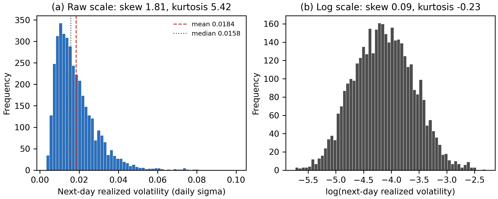
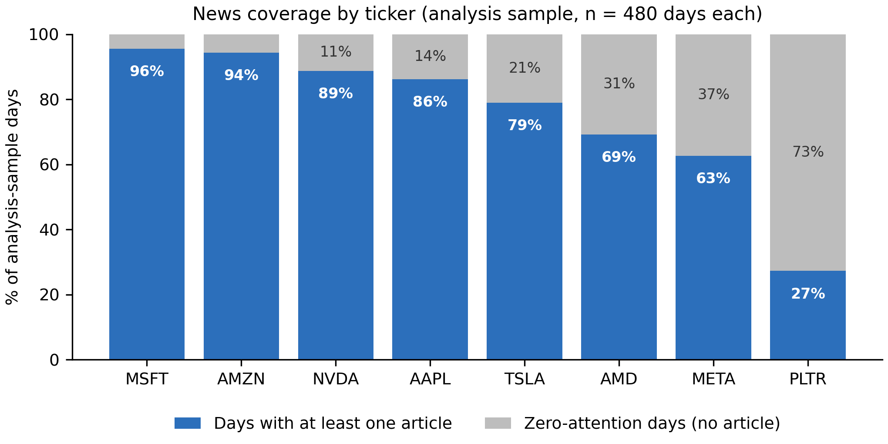
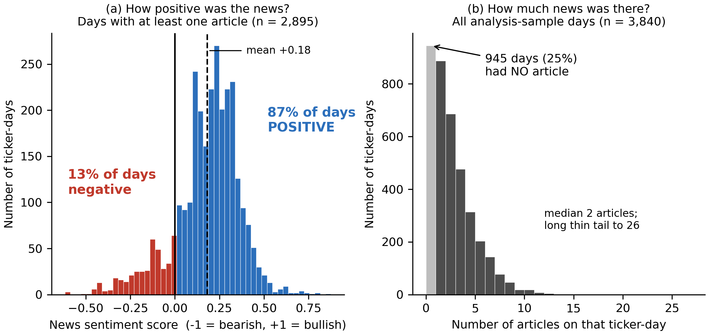
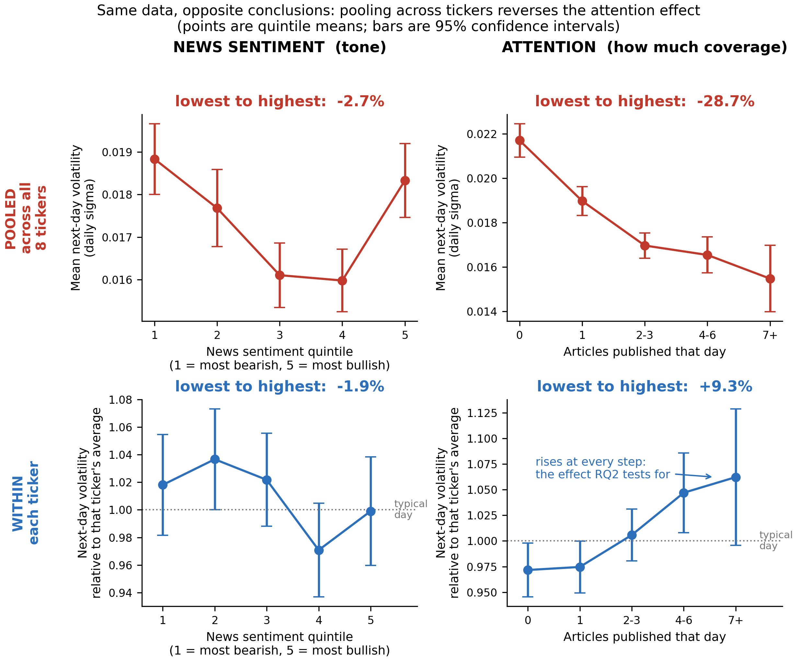
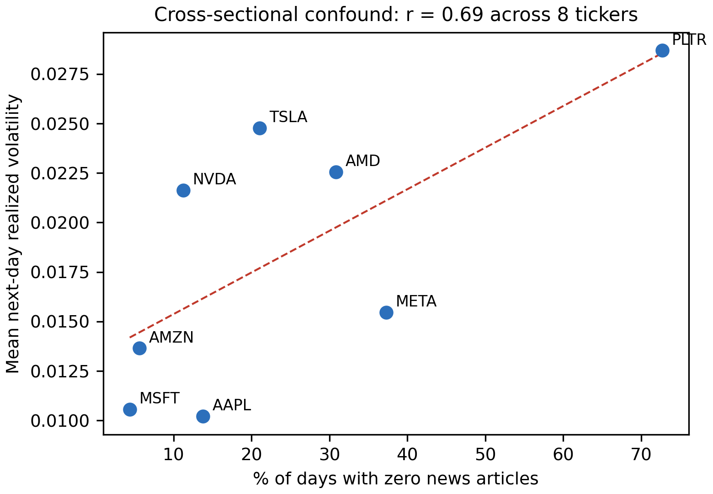
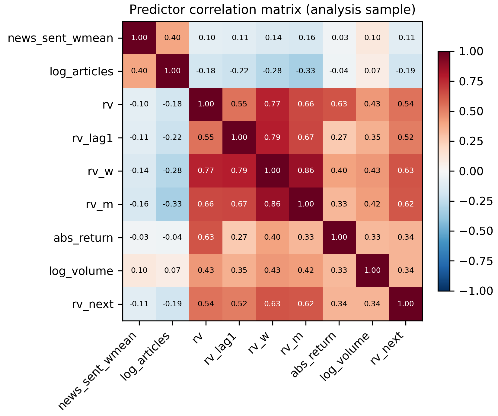
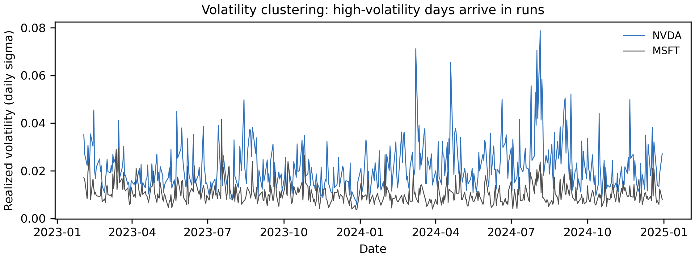

# Method Walkthrough

**Retail Sentiment as a Volatility Early-Warning Signal**
QM640 Data Analytics Capstone · James Savage · Group 12

A plain-language account of how the data is collected, cleaned and explored, written so that
every step and every chart can be explained and defended. Numbers quoted here are produced by
the scripts named alongside them and are reproducible by re-running the pipeline.

---

## 1. The data dictionary discrepancy: 11 variables or 15?

**Both are correct — they are different versions.** GitHub is showing an older commit.

| | Variables | Where |
|---|---|---|
| Committed to GitHub | 11 | `data/data_dictionary.csv` at `HEAD` |
| Current working copy | 15 | same file, regenerated locally |
| Table 2 in the interim report | 15 | matches the working copy |

The panel originally had 11 columns. Rebuilding it added **four** new ones, taking it to 15:

| New variable | What it is | Why it was added |
|---|---|---|
| `rv_w` | Weekly HAR component: mean realized volatility over days *t*−4 to *t* | The report claims a HAR baseline, but HAR is defined by its **three** components — daily, weekly, monthly. The panel only had the daily one, so the stated baseline could not actually be estimated. |
| `rv_m` | Monthly HAR component: mean realized volatility over days *t*−21 to *t* | As above. This is also what costs 21 ticker-days per ticker of sample. |
| `news_missing` | 1 if no article mentioned the ticker that day, else 0 | Lets a model tell "coverage was neutral in tone" apart from "there was no coverage at all". Without it those two very different situations look identical. |
| `log_articles` | log(1 + article count) | The attention proxy in the form the models use. Only meaningful once zero-article days are retained (§3.3). |

**11 + 4 = 15.** Nothing was removed or renamed.

**To fix the discrepancy**, commit and push the regenerated files:

```bash
git add data/data_dictionary.csv data/data_dictionary.md
git commit -m "Regenerate data dictionary: 15 variables incl. HAR components and attention flags"
git push
```

The dictionary is generated by `src/make_data_dictionary.py`, not typed by hand, and it reads
observed ranges from the live panel — so it cannot silently drift out of step with the data.
That is worth saying to your mentor: the dictionary is an *output* of the pipeline, not a
document maintained beside it.

---

## 2. The pipeline, stage by stage

Six stages. Each is a separate script, each is re-runnable, and each is safe to run twice.

```
   Tiingo          Alpha Vantage        StockTwits
  (prices)          (news sent.)        (messages)
      │                   │                  │
      ▼                   ▼                  ▼
 collect_prices    collect_news_       collect_stocktwits
      │             sentiment                │
      └─────────┬─────────┘                  │
                ▼                            │
         build_features.py                   │
        (panel.csv, 15 cols)                 │
                │                            │
                ▼                            │
        validate_panel.py                    │
          (27 assertions)                    │
                │                            │
     ┌──────────┴──────────┐                 │
     ▼                     ▼                 ▼
  run_eda.py         RQ2–RQ4 models      RQ1 model
 (figures/tables)   (volatility, etc.)  (FinBERT vs lexicon)
```

### Stage 1 — Collection

| Source | Script | What it retrieves | Volume |
|---|---|---|---|
| **Tiingo** | `collect_prices.py` | Split- and dividend-adjusted daily OHLCV | 24 tickers, 2023–2024, 24 files |
| **Alpha Vantage** | `collect_news_sentiment.py` | Per-article sentiment and relevance scores | 8 tickers × 24 months = 192 files |
| **StockTwits** | `collect_stocktwits.py` | Recent messages with self-tagged bull/bear labels | 23 files, 10,018 unique messages |

Three design points worth being able to explain:

**Why three sources rather than one.** Prices give the target and controls. Alpha Vantage gives
historical sentiment across 2023–2024. StockTwits gives *human-labelled* sentiment, which is what
RQ1 needs to grade a sentiment model against — but it only serves recent messages, so it cannot
cover the historical window. Hence StockTwits is a **validation corpus for RQ1**, deliberately not
merged into the historical panel.

**Why adjusted prices.** NVIDIA split 10-for-1 in June 2024. On unadjusted prices that appears as
a −90% single-day move, which a volatility estimator would read as an enormous shock. The
collector requests `adjOpen/adjHigh/adjLow/adjClose/adjVolume`. This was verified rather than
assumed: on the split date the adjusted series moves +0.75%, i.e. an ordinary day.

**Why the collectors are resumable.** The Alpha Vantage free tier allows 25 requests per day, so
192 requests take roughly eight sessions. Each script caches what it already has and skips it, and
backs off on timeouts — necessary given collection ran over an intermittent connection.

### Stage 2 — Feature building (`build_features.py`)

Per ticker, in date order:

1. **Realized volatility** from the daily high–low range using the Parkinson estimator:
   σ = √[(1 / (4 ln 2)) · ln(H/L)²]. A range-based estimator is used because it needs no intraday
   data, which is not available on free tiers.
2. **HAR components** — `rv` (daily), `rv_w` (5-day mean), `rv_m` (22-day mean).
3. **Controls** — log return, absolute return, log volume.
4. **The target** — `rv_next`, realized volatility shifted back one trading day.
5. **Merge news** onto the trading calendar, apply the zero-attention rule (§3.3).

### Stage 3 — Validation (`validate_panel.py`)

27 assertions in six groups; the script exits with an error if any fail, so a broken panel cannot
reach the models. Currently **27/27 pass**.

The group that matters most is the **point-in-time reconstruction test**. For 30 randomly chosen
ticker-days it rebuilds every predictor using only raw records dated on or before day *t*, then
demands an exact match with the stored value. Largest discrepancy across all 11,873 ticker-days:
about 10⁻¹⁶ — floating-point rounding.

> **If your mentor asks one hard question, it will be this one:** *how do you know you're not
> accidentally using tomorrow's data to predict tomorrow?* The answer is that the pipeline
> simulates standing at the close of day *t* with no knowledge of the future, rebuilds each
> feature from scratch, and checks it matches. It is tested, not asserted.

---

## 3. Preprocessing decisions

Four decisions carry real methodological weight.

### 3.1 The predictive alignment (*t* → *t*+1)

Every predictor is dated on or before day *t*; the target is day *t*+1. This removes look-ahead
bias and the contemporaneous simultaneity problem — news moves sentiment and price at the same
moment, so a same-day correlation cannot tell you which drove which.

One subtlety worth understanding: **`rv` at day *t* is a legitimate predictor.** It is computed
from day *t*'s high and low, so it is known at that day's close, and the forecast is for *t*+1.
This is why the HAR windows *end at t and include it* rather than being shifted back — that is the
standard HAR specification, and shifting would discard a day of genuine information.

### 3.2 Missing values, handled by category

There is no single global rule, because the causes differ:

| Cause | Count | Treatment | Reasoning |
|---|---|---|---|
| First 21 days per ticker | 168 | Drop | `rv_m` genuinely undefined until the window fills. Imputing would invent history. |
| Final day per ticker | 8 | Drop | `rv_next` does not exist for the last observation. |
| No news that day | 945 | **Keep**, as zero | Not missing — see below. |
| Prices/volume | 0 | n/a | Tiingo series is complete across the window. |

### 3.3 Zero-attention days — the most important call

Originally these were dropped, because joining the news files to the trading calendar produced no
match. **That was wrong**, and correcting it changed the study materially.

A day on which no article mentions a ticker is not a failed measurement. It is a real observation:
*nobody was paying attention*. Dropping such days does three bad things:

1. **Truncates the attention variable at 1.** You can never observe zero attention, which is
   precisely the low-attention contrast the study depends on. It is like studying whether crowd
   size predicts trouble at a venue, but only collecting data on nights when a crowd showed up.
2. **Loses data unevenly.** PLTR would forfeit 73% of its history, MSFT 4% — leaving a badly
   unbalanced panel.
3. **Discards 945 usable observations.**

They are now retained as `article_count = 0`, `sentiment = 0` (neutral), `news_missing = 1`.

| | Before | After |
|---|---|---|
| Analysis sample | 3,026 | **3,840** |
| Days per ticker | 133 – 478 (unbalanced) | **480 each (balanced)** |
| Minimum article count | 1 | **0** |

**The guard that matters:** this applies *only* to the eight tickers actually queried. For the
other sixteen, no request was ever made, so their news fields stay null. Writing a zero there
would fabricate "we looked and found nothing" out of "we never looked". The validation harness
asserts no such value exists.

### 3.4 Outliers — kept, not trimmed

The screen flagged two moves above 30%: **ARM +47.9%** (8 Feb 2024) and **PLTR +30.8%**
(6 Feb 2024). Both were tested two ways:

- **Split-ratio test.** An unadjusted split lands almost exactly on a simple fraction. These are
  1.479 and 1.308 — neither is close.
- **Volatility path.** A split moves the price but leaves volatility unchanged. ARM's realized
  volatility went 0.030 → 0.179 across several sessions. That is a real market event.

Both are post-earnings repricings and are **retained**. Extreme volatility is the phenomenon the
study forecasts; winsorising it away would delete the signal of interest.

### 3.5 Scaling and encoding

| Model | Treatment | Why |
|---|---|---|
| Logistic regression | Standardise to zero mean, unit variance | Coefficient size would otherwise depend on each variable's units |
| Gradient boosting | No scaling | Tree splits are invariant to any monotonic rescaling |
| Volume, article count | Log transform | Both heavily right-skewed |
| Target | Log transform | See Figure 1 |
| `symbol` (categorical) | Ticker fixed effect, not one-hot | See Figures 4 and 5 |

---

## 4. The exploratory analysis, chart by chart

All figures come from `src/run_eda.py`. Each is here for a reason, and each ends in a decision.

### Figure 1 — Distribution of the target



**Question:** what shape is the thing we are trying to predict?

**Why this chart:** a histogram is the most direct way to see skew and tail weight, and showing
raw and logged side by side makes the effect of the transform self-evident rather than asserted.

**What it shows:** raw next-day volatility is strongly right-skewed (skew 1.81, kurtosis 5.42) —
most days quiet, a few extreme. Logged, it is close to normal (skew 0.09, kurtosis −0.23).

**Decisions:** model **log(rv_next)**, so a handful of earnings days don't dominate the fit; and
report **QLIKE alongside RMSE**, because squared-error loss on a fat-tailed target rewards a model
that chases the tail at the expense of the other 95% of days.

---

### Figure 2 — News coverage by ticker



**Question:** is news coverage evenly spread, or does it differ by firm?

**Why this chart:** a stacked bar makes "share of days covered" immediately readable and shows
the zero-attention portion as a visible quantity rather than a footnote.

**What it shows:** coverage ranges from **27% (PLTR)** to **96% (MSFT)**. This is not noise — it
is a stable characteristic of each firm.

**Decisions:** retain zero-attention days and include the `news_missing` indicator. It also
raises the suspicion that coverage is entangled with something else about each stock — which
Figure 5 confirms.

---

### Figure 3 — Sentiment and attention distributions



**How to read it:** both panels are histograms, and each observation is one **ticker-day** (one
stock on one trading day). The x-axis sorts days into bins; the bar height counts how many days
fell in each bin.

- **Panel (a)** — the x-axis is the sentiment score from −1 (bearish) to +1 (bullish). The mass
  piled between +0.10 and +0.30 means most days carried *mildly positive* news. Red bars are the
  minority of days with negative news. It is restricted to days that actually had an article
  (2,895 of 3,840); including zero-news days would stack a fake spike at exactly 0.0 from the
  neutral-fill rule.
- **Panel (b)** — the x-axis is the number of articles that day. The grey bar at 0 is the 945
  zero-attention days; most days carry one to four articles, with a thin tail out to 26.

**Question:** how much usable variation do the two predictors actually contain?

**Why this chart:** a predictor with little spread cannot explain much, no matter how good the
model. This is a feasibility check, done *before* modelling rather than after a disappointing result.

**What it shows:** sentiment averages **+0.181** and is positive on **87%** of days with news —
so there is far more positive than negative variation. Attention is concentrated at low counts
(median 2, max 26).

**Decisions:** log-transform attention; record the sentiment asymmetry as a **limitation**, since
it caps how large any detectable sentiment effect could be. This also sets honest expectations:
if sentiment turns out weak in RQ2, this is part of the reason.

---

### Figure 4 — Quintile means, pooled versus within ticker



**This is the most important figure in the analysis.**

**Question:** does higher sentiment or attention on day *t* precede higher volatility on *t*+1?

**Why this chart:** group means with confidence intervals reveal weak, possibly non-linear
relationships that a single correlation coefficient would hide. The pooled/within pairing was
added *after* the pooled result looked wrong — which is itself the point.

**How to read it:** columns are the two predictors (tone on the left, coverage volume on the
right); rows are the two ways of grouping the data. The **top row** pools all 3,840 ticker-days
and plots raw volatility in daily sigma. The **bottom row** compares each stock against its own
history, so the y-axis is volatility *relative to that ticker's average* — 1.00 is a normal day
for that stock, 1.06 is 6% more volatile than usual for it. Vertical bars are 95% confidence
intervals: where they overlap heavily, the difference is not statistically meaningful.

**What it shows:**

| | Pooled | Within ticker |
|---|---|---|
| Attention, lowest vs highest band | **−28.7%** | **+9.3%** |
| Sentiment, Q1 vs Q5 | −2.7% | −1.9% |

The attention effect **reverses sign**. Pooled, it contradicts the literature. Compared within
each ticker — each stock against its own average — it points the direction Audrino et al. (2020)
report, and rises monotonically across all five bands.

**Why attention is banded by article count rather than cut into quintiles:** a quarter of
ticker-days have exactly zero articles, so quantile boundaries either collapse onto the same
value (giving four groups, which looks like a bug) or split identical observations across
different bins (which dilutes the gradient). Bands of 0, 1, 2–3, 4–6 and 7+ are interpretable
and each spans a genuinely different level of coverage.

**Decisions:** all RQ2 and RQ3 models must include **ticker fixed effects**. Attention, not
sentiment tone, is the stronger candidate predictor.

> Had this not been checked, the report would have stated that news attention *reduces* next-day
> volatility. That is the single biggest error the EDA prevented.

---

### Figure 5 — The confound, quantified



**Question:** *why* did the sign reverse?

**Why this chart:** a scatter at the ticker level — eight points, one per stock — isolates the
between-firm relationship that the pooled analysis was accidentally picking up. Labelling each
point makes the mechanism concrete rather than abstract.

**What it shows:** across the eight tickers, the share of zero-attention days correlates **0.69**
with average volatility. PLTR has the least coverage (73% of days with no article) and the highest
volatility (0.0287). MSFT has the most coverage (4%) and among the lowest (0.0106).

**The mechanism, in plain terms:** in pooled data, "low attention" is largely a label for *which
stock this is*, not information about *what is about to happen to it*. Comparing a quiet day for
PLTR against a busy day for MSFT compares two different companies, not two different conditions.

This is a **Simpson's paradox** — a relationship that holds inside every group reverses when the
groups are pooled.

**Decision:** within-ticker results are the primary finding; pooled results appear only as a
cautionary contrast.

---

### Figure 6 — Correlation matrix



**Question:** what is already doing the predictive work, before sentiment is added?

**Why this chart:** a heatmap shows every pairwise relationship at once, including among the
controls, which matters for the multicollinearity check.

**What it shows:** `rv_w` correlates **0.63** with the target. Sentiment manages **−0.11** and
attention **−0.15**.

**Decision:** sentiment cannot be judged on raw correlation — it will always look weak next to
lagged volatility. RQ2 must be an **incremental** test: does sentiment add anything *once HAR is
already in the model*? This is why the hypothesis is framed as an incremental F-test and a
Diebold–Mariano comparison rather than a simple regression coefficient.

---

### Table 5 — Variance inflation factors

**Question:** are the controls so overlapping that coefficients become unstable?

**Why this check:** Step 4 of the research design requires it, and several controls measure
closely related quantities. If two predictors carry nearly the same information, the model cannot
attribute credit between them and coefficient signs can flip meaninglessly.

| Predictor | VIF | Assessment |
|---|---|---|
| `rv_w` | 7.91 | Moderate |
| `rv_m` | 4.20 | Acceptable |
| `rv` | 3.63 | Acceptable |
| `rv_lag1` | 2.71 | Acceptable |
| `abs_return` | 1.74 | Acceptable |
| `log_volume` | 1.40 | Acceptable |
| `log_articles` | 1.36 | Acceptable |
| `news_sent_wmean` | 1.20 | Acceptable |

**What it shows:** nothing exceeds the threshold of 10. `rv_w` is highest at 7.91, expected since
it is a moving average of `rv`. Crucially the **sentiment features are near-orthogonal** to the
market controls (1.36 and 1.20).

**Decision:** retain the full control set. And a useful reassurance for RQ2 — whatever incremental
contribution sentiment makes, it will not be an artefact of overlap with lagged volatility.

---

### Figure 7 — Volatility clustering



**Question:** is volatility independent day to day, or does it persist?

**Why this chart:** a time series is the only way to see persistence. Two contrasting tickers
show the pattern is general, not stock-specific.

**What it shows:** volatility arrives in runs. Quiet periods persist; turbulent periods persist.

**Decisions:** the benchmark for RQ2 is a **HAR baseline, not a naive mean** — because lagged
volatility alone already forecasts well. This sets a deliberately demanding standard: sentiment
must improve on a baseline that is already informative. It also justifies why the HAR components
exist at all.

---

## 5. Where this leaves the study

**Settled and defensible:**

- 3,840 ticker-days, balanced at 480 per ticker, every value traceable to a raw file
- No look-ahead bias — tested, not assumed
- Preprocessing decisions documented with reasoning, including one correction that mattered
- Ticker fixed effects justified by evidence rather than convention

**Known limitations to state plainly:**

| Limitation | Consequence |
|---|---|
| Sentiment is positive on 87% of days | Caps the detectable sentiment effect |
| Attention measures *news-media* coverage, not *retail* attention | The honest retail measure would be StockTwits volume, unavailable historically |
| RQ4 needs 1,558 trading days; the window has 500 | The backtest is under-powered; a null result is inconclusive, not negative |
| Eight tickers, all US large-cap technology | Findings may not generalise to other sectors or market caps |
| **3,840 rows are not 3,840 independent observations** | Effective sample ≈ 1,093 — see below |
| **The window contains one volatility regime** | Validated under calm-to-moderate conditions only |

### Is there enough data? Yes for RQ1–RQ3, no for RQ4

| RQ | Required | Available | Verdict |
|---|---|---|---|
| RQ1 | 385 labelled messages | 4,222 | 11× — comfortable |
| RQ2 | 549 ticker-days | 3,840 | 7× — adequate |
| RQ3 | 614 ticker-days | 3,840 | 6× — adequate |
| RQ4 | 1,558 trading days | 500 | **3× short** |

**But the row count overstates precision.** The eight tickers move together — mean pairwise
correlation of realized volatility is **0.359**. The standard adjustment for *k* equicorrelated
series is *k*_eff = *k* / (1 + (*k*−1)ρ):

```
8 / (1 + 7 × 0.359) = 2.28 effective series, not 8
2.28 × 480 dates    ≈ 1,093 effective observations, not 3,840
```

Eight highly correlated mega-cap technology stocks behave like roughly two independent series.
What this means for RQ2's smallest detectable effect:

| Basis | N | Detectable *f²* |
|---|---|---|
| Pooled rows (optimistic) | 3,840 | 0.003 |
| **Correlation-adjusted (reported)** | **1,093** | **0.010** |
| Date clusters (conservative) | 480 | 0.023 |

Cohen's "small" is *f²* = 0.02, so even on the honest basis the design detects a small effect —
which is the magnitude the literature says to expect. Adequate, not lavish. RQ4 isn't rescued
this way, because a portfolio backtest yields one return series regardless of ticker count.

**The regime limitation matters more than sample size.** Quarterly cross-sectional mean
volatility across the window:

```
2023 Q1  0.0209      2024 Q1  0.0176
2023 Q2  0.0188      2024 Q2  0.0177
2023 Q3  0.0187      2024 Q3  0.0203
2023 Q4  0.0167      2024 Q4  0.0176
```

Highest to lowest is only **1.25×**. Two years, essentially **one regime** — a steady technology
bull market with no crisis. A volatility early-warning system is most valuable exactly when
conditions shift, and this window never tests that.

**So what can be claimed:** that sentiment and attention improve next-day volatility forecasts
for large-cap US technology equities *under the conditions observed in 2023–2024*. Not that the
result extends to other sectors, smaller capitalisations, or stressed markets.

All figures above are produced by the `sample_adequacy()` function in `src/run_eda.py`.

**Still to do:** RQ1 (FinBERT vs lexicon), RQ2 (HAR vs augmented), RQ3 (direction), RQ4 (backtest).

---

## Reproducing everything

```bash
uv sync
uv run src/build_features.py      # rebuild panel.csv
uv run src/validate_panel.py      # 27 assertions, must pass
uv run src/run_eda.py             # figures -> docs/figures, tables -> docs/tables
uv run src/make_data_dictionary.py
```
